# [PROJECT 1](https://shugu19.github.io/Project-1)

# Project Overview: Personal Portfolio Website

Welcome to my Personal Portfolio Website – a digital space where I showcase my skills, experiences, and creative projects. This project is more than just a website; it's a dynamic representation of who I am and what I bring to the table. Designed with a sleek and user-friendly interface, my portfolio aims to provide visitors with a comprehensive understanding of my capabilities, making it a valuable resource for potential employers, collaborators, and anyone interested in my work.

## Project Goals:

1. **Showcasing Expertise:** The primary goal of my portfolio website is to present a detailed overview of my skills, ranging from technical proficiencies to creative talents. Through the 'About' section, visitors can gain insights into my background, education, and professional journey, creating a personal connection beyond the resume.

2. **Highlighting Services:** The 'Services' section is dedicated to outlining the specific services I offer. Whether it's web development, graphic design, content creation, or any other skill set, this section serves as a clear guide for potential clients or collaborators, allowing them to understand the range of services I provide.

3. **Portfolio Display:** The 'Portfolio' section serves as a visual gallery, showcasing a curated selection of my best work. Each project is presented with detailed descriptions, technologies used, and the challenges overcome, providing a deeper understanding of my abilities and creative approach.

4. **User-Friendly Experience:** The website is designed with a clean and intuitive interface, ensuring a seamless navigation experience for visitors. From the moment they land on the homepage to exploring individual projects, the user interface prioritizes ease of use, making it accessible to a diverse audience.

5. **Contact Section:** To encourage collaboration and networking, the 'Contact' section provides visitors with multiple avenues to connect with me. Whether it's for job opportunities, project inquiries, or just a friendly conversation, this section facilitates communication, fostering potential partnerships.

## Target Audience:

- **Employers and Recruiters:** The portfolio serves as a comprehensive resource for employers and recruiters to assess my skills, experience, and suitability for potential roles.
- **Clients and Collaborators:** Individuals or organizations seeking specific services can easily navigate the 'Services' and 'Portfolio' sections to evaluate my capabilities and determine if I'm the right fit for their project.

- **Peers and Networking Contacts:** The website is also a tool for connecting with fellow professionals, creatives, and like-minded individuals interested in collaboration, knowledge sharing, or networking opportunities.

In summary, my Personal Portfolio Website is more than just a collection of web pages; it's a strategic tool crafted to showcase my professional identity, connect with a diverse audience, and open doors to exciting opportunities. Explore the various sections to discover the skills, experiences, and projects that define me as a versatile and dedicated professional.

Here's deployed site:
https://ui.dev/amiresponsive?url=https://shugu19.github.io/Project-1

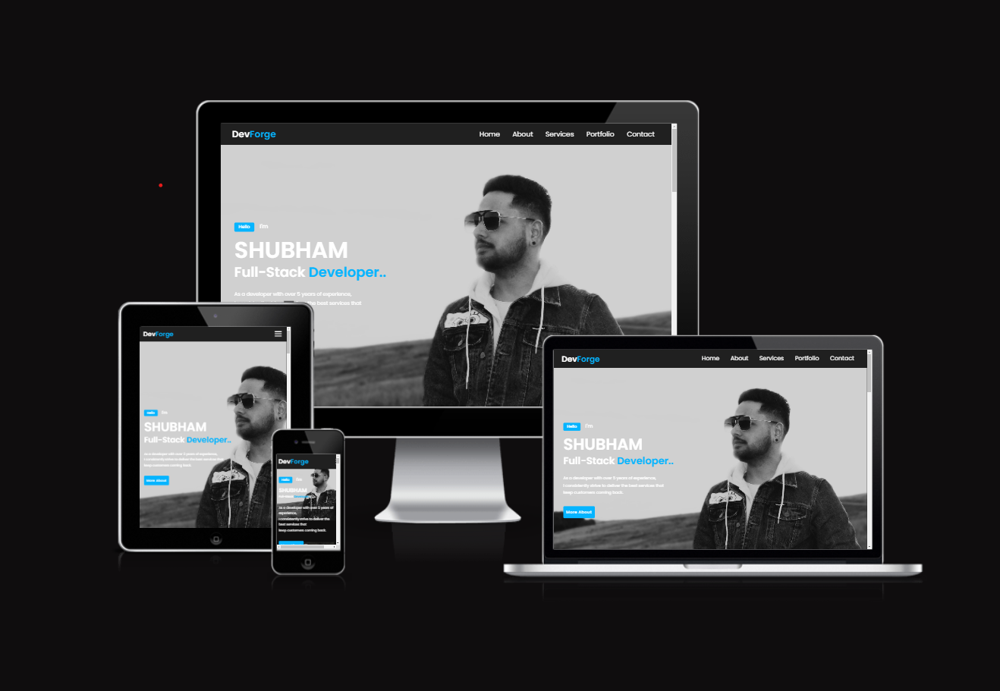

## UX

I've used CSS `:root` variables to easily update the global colour scheme by changing only one value, instead of everywhere in the CSS file.

```css
:root {
  --bg-color: #0f0e0e;
  --second-bg-color: #202020;
  --text-color: #fff;
  --second-text-color: #ccc;
  --main-color: #05b4ff;
  --big-font: 5rem;
  --h2-font: 3rem;
  --p-font: 1.1rem;
}
```

### Typography

- [Montserrat](https://fonts.googleapis.com/css2?family=Montserrat:wght@300;500;600;800;900&family=Poppins:wght@300;400;500;600&display=swap);
  was used for the primary headers and titles and others.

## User Stories

### New Site Users

- As a new site user, I would like to **explore the 'Home' section**, so that I can quickly understand the purpose of the website and get an overview of the creator's identity and expertise.

- As a new site user, I would like to **navigate to the 'About' section**, so that I can delve deeper into the background, education, and professional journey of the website creator, establishing a personal connection.

- As a new site user, I would like to **check out the 'Services' section**, so that I can understand the specific skills and services offered by the creator, helping me determine if they align with my needs or interests.

- As a new site user, I would like to **explore the 'Portfolio' section**, so that I can visually experience the creator's previous work, gaining insights into their capabilities, style, and the range of projects they have undertaken.

- As a new site user, I would like to **visit the 'Contact' section**, so that I can easily find ways to connect with the creator, whether for job opportunities, project collaborations, or general inquiries.

### Returning Site Users

- As a returning site user, I would like to **access the 'Portfolio' section directly from the homepage**, so that I can quickly view any new projects or updates since my last visit.

- As a returning site user, I would like to **check for any updates in the 'Services' section**, so that I can stay informed about additional skills or services the creator may have added since my last visit.

- As a returning site user, I would like to **explore the 'About' section periodically**, so that I can stay updated on any changes or developments in the creator's professional journey and skills.

- As a returning site user, I would like to **easily find and use the contact information**, so that I can reach out to the creator for potential collaborations or follow-up discussions.

- As a returning site user, I would like to **benefit from a responsive and intuitive navigation system**, so that I can efficiently explore the website and find the information I need with ease, enhancing my overall user experience.

## Wireframes

### Mobile Wireframes

<details>
<summary> Click here to see the Mobile Wireframes </summary>

Home

- 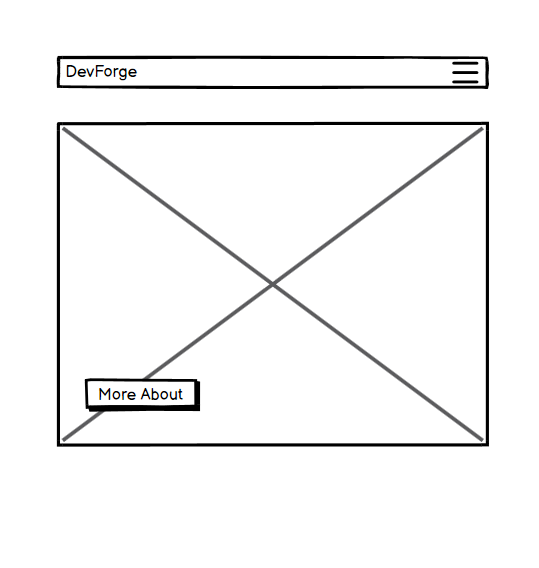

About

- 

Services

- 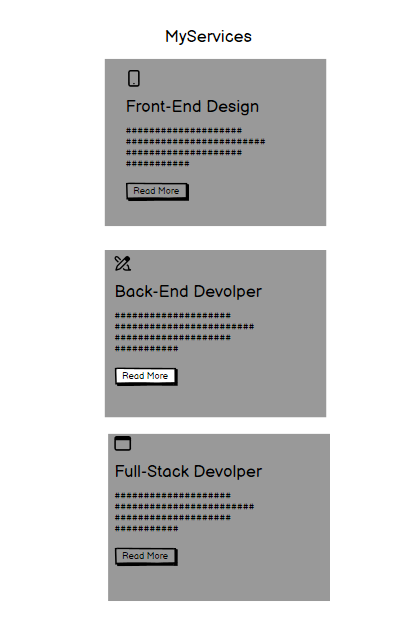

Portfolio

- 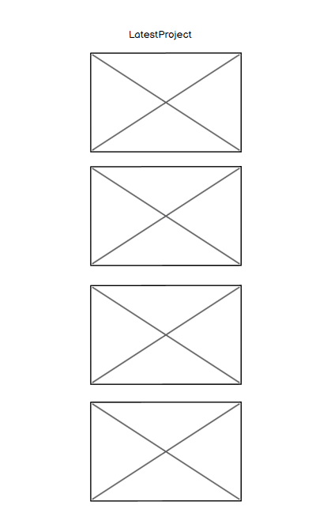

Contact

- 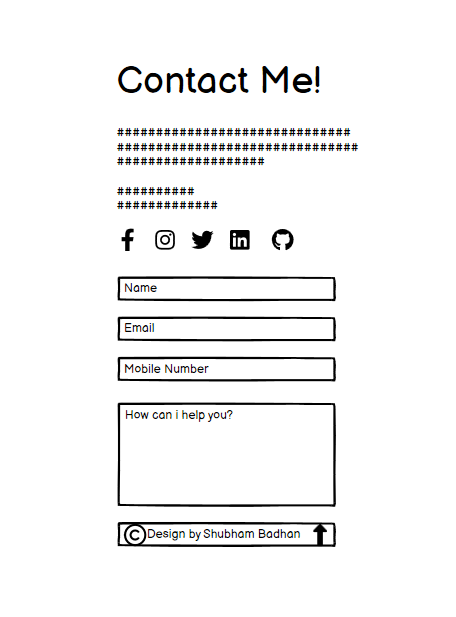

</details>

### Tablet Wireframes

<details>
<summary> Click here to see the Tablet Wireframes </summary>

Home

- 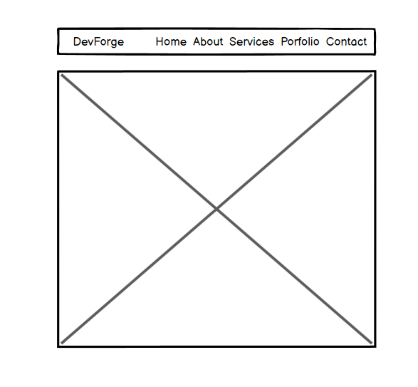

About

- 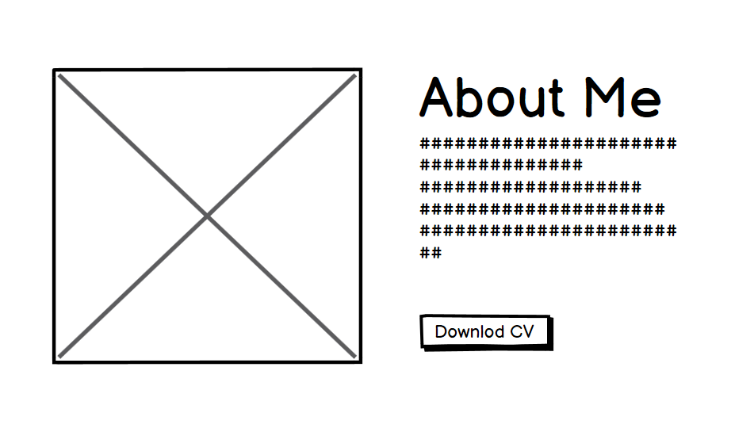

Services

- 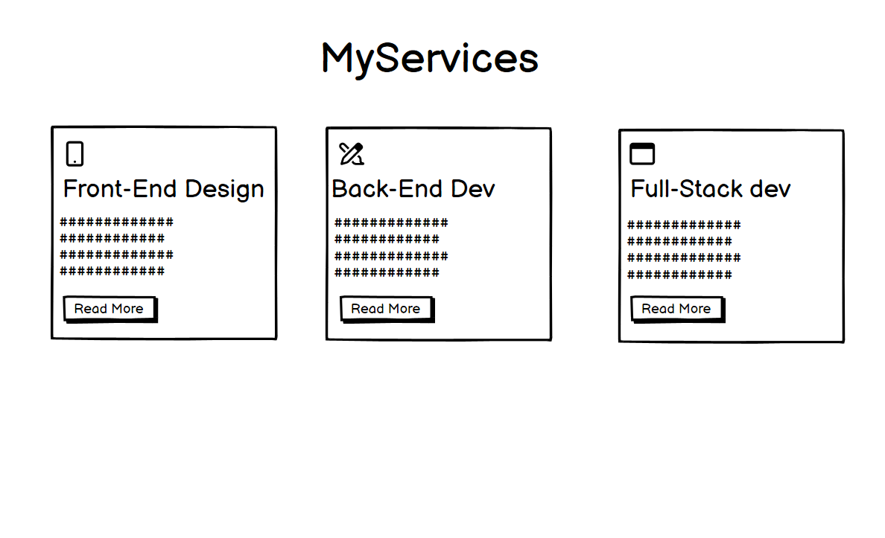

Portfolio

- 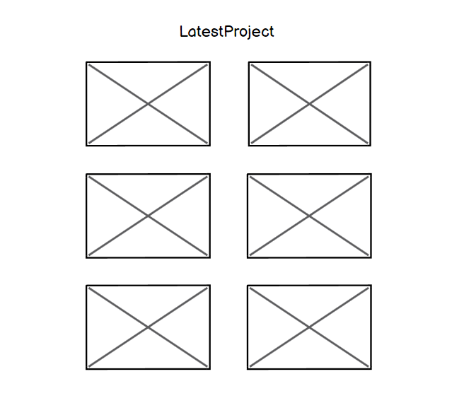

Contact

- 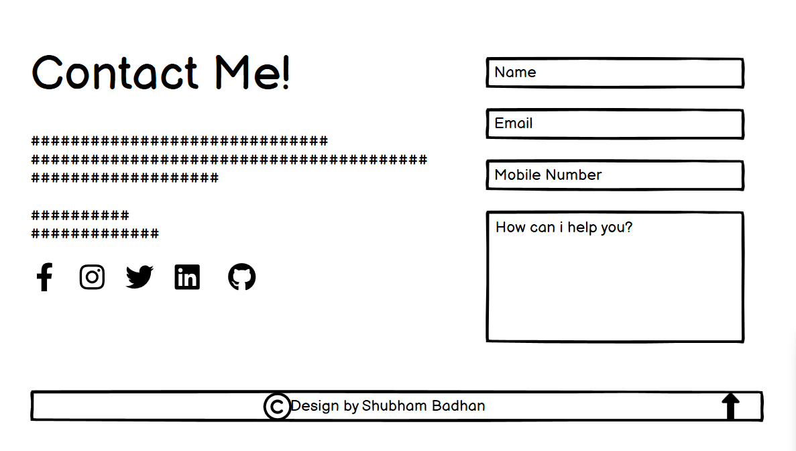

</details>

### Desktop Wireframes

<details>
<summary> Click here to see the Desktop Wireframes </summary>

Home

- 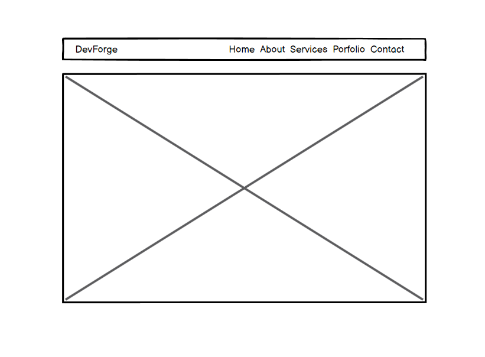

About

- 

Services

- 

Portfolio

- 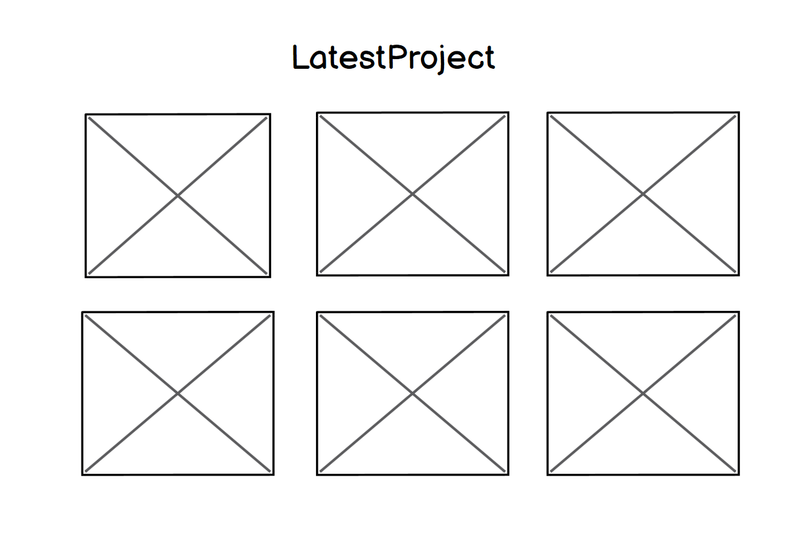

Contact

- 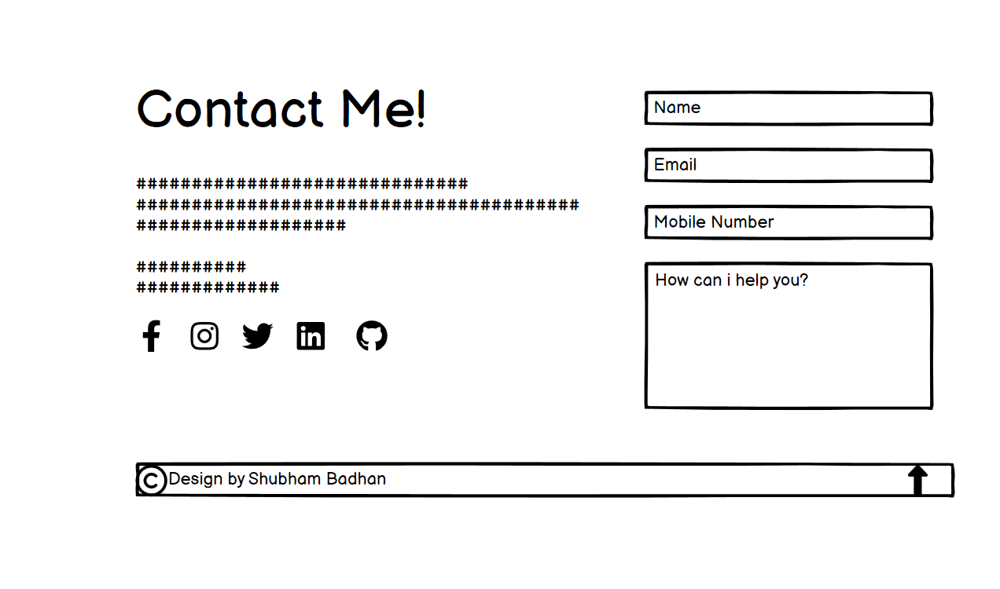

</details>

## Features

## Portfolio Website Features

### Home

The Home section serves as the landing page, offering a welcoming introduction to visitors. It provides a brief overview of my skills and expertise as a Full Stack Developer, enticing users to explore further.

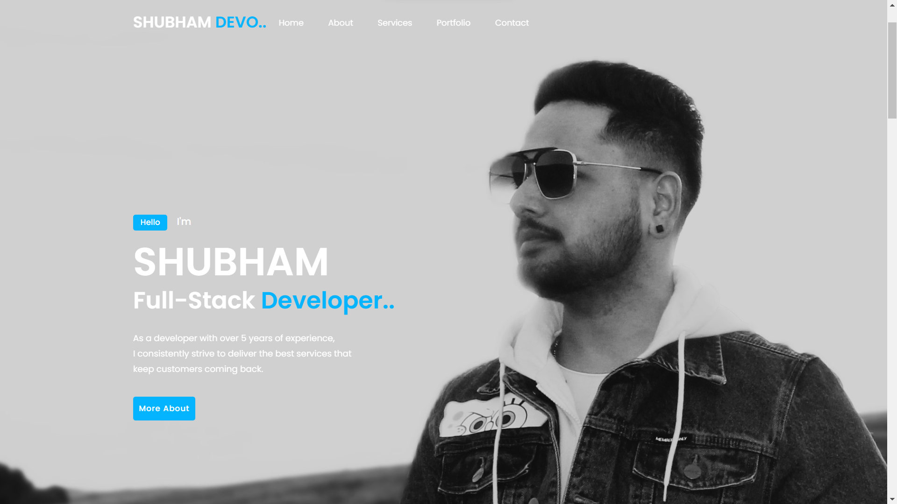

### About

In the About section, users get an in-depth understanding of my background, education, and professional journey. It aims to create a personal connection, showcasing my commitment to continuous learning and technological innovation.

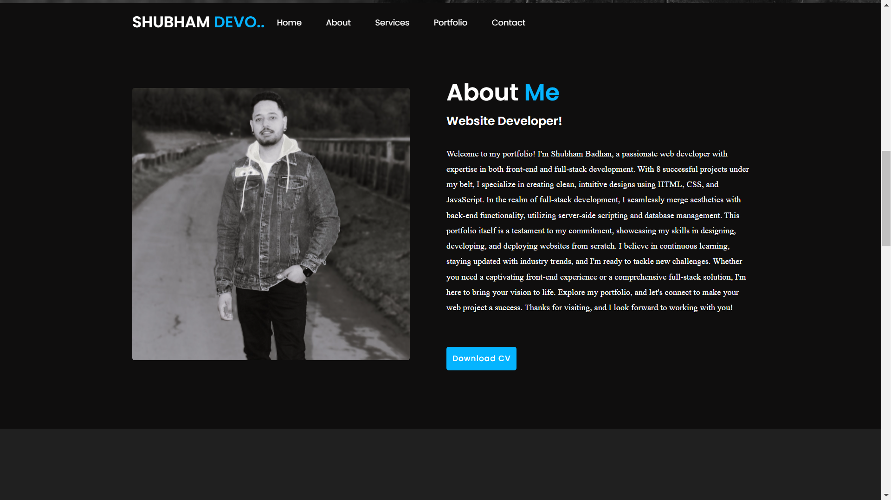

### Services

The Services section highlights my specialization areas, including Front-end Design, Back-end Development, and Full Stack expertise. It articulates the value I bring to the table for potential collaborations or projects.

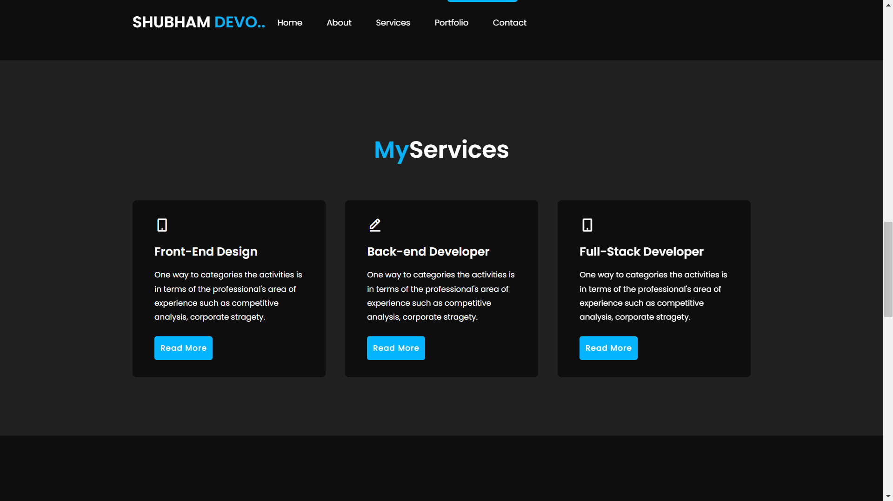

### Portfolio

The Portfolio segment showcases a collection of my notable projects. Visitors can explore diverse applications, from dynamic web apps to robust databases, providing a comprehensive view of my technical capabilities.

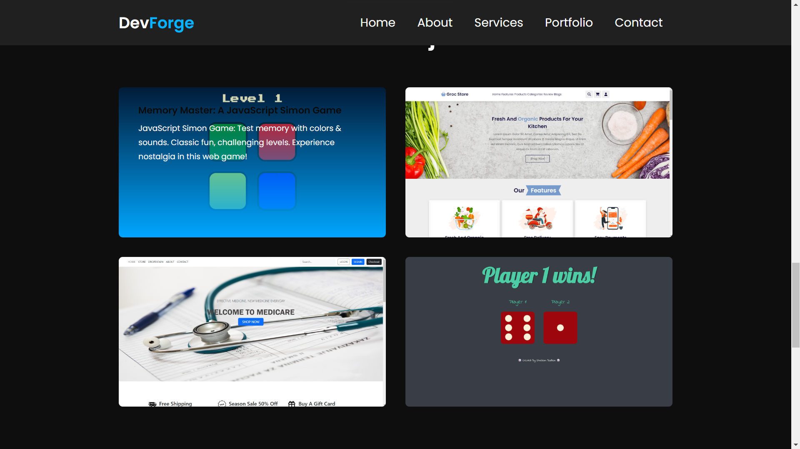

### Contact

For easy communication, the Contact section offers various channels through which visitors can reach out. It includes my phone number, email address, and a contact form, fostering seamless interaction.

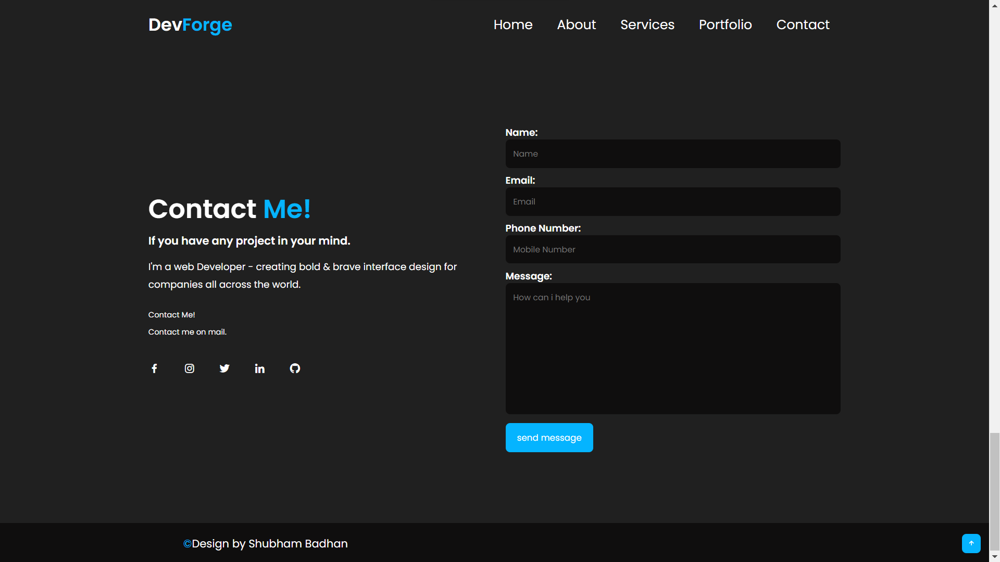

---

### Future Features

### Expanded Project Portfolio

In the near future, I aim to incorporate projects utilizing cutting-edge technologies such as Artificial Intelligence and Machine Learning algorithms. These additions will showcase my exploration and proficiency in these dynamic fields, offering visitors a glimpse into innovative applications and solutions.

### AI-Powered Solutions

Integrating Artificial Intelligence (AI) and Machine Learning (ML) algorithms will enable the development of intelligent applications. These projects will demonstrate my ability to harness AI for predictive analytics, natural language processing, computer vision, and other exciting domains.

### Enhanced Interactivity

I plan to enhance the interactivity of the website, potentially incorporating features like real-time demos or interactive components that allow visitors to engage with the showcased projects, providing a hands-on experience.

### Continuous Learning

As technology advances, I am committed to staying at the forefront of innovation. I'll be consistently updating my portfolio with new skills, certifications, and projects, reflecting my ongoing journey of learning and growth within the tech industry.

---

## Tools & Technologies Used

- [HTML](https://en.wikipedia.org/wiki/HTML) used for the main site content.
- [CSS](https://en.wikipedia.org/wiki/CSS) used for the main site design and layout.
- [CSS :root variables](https://www.w3schools.com/css/css3_variables.asp) used for reusable styles throughout the site.
- [CSS Flexbox](https://www.w3schools.com/css/css3_flexbox.asp) used for an enhanced responsive layout.
- [CSS Grid](https://www.w3schools.com/css/css_grid.asp) used for an enhanced responsive layout.
- [JavaScript](https://www.javascript.com) used for user interaction on the site.
- [Git](https://git-scm.com) used for version control. (`git add`, `git commit`, `git push`)
- [GitHub](https://github.com) used for secure online code storage.
- [GitHub Pages](https://pages.github.com) used for hosting the deployed front-end site.
-

## Testing

For all testing, please refer to the [TESTING.md](TESTING.md) file.

## Deployment

The site was deployed to GitHub Pages. The steps to deploy are as follows:

- In the [GitHub repository](https://github.com/Shugu19/Project-1), navigate to the Settings tab
- From the source section drop-down menu, select the **Main** Branch, then click "Save".
- The page will be automatically refreshed with a detailed ribbon display to indicate the successful deployment.

The live link can be found [here](https://shugu19.github.io/Project-1)

### Local Deployment

This project can be cloned or forked in order to make a local copy on your own system.

#### Cloning

You can clone the repository by following these steps:

1. Go to the [GitHub repository](https://github.com/Shugu19/Project-1)
2. Locate the Code button above the list of files and click it
3. Select if you prefer to clone using HTTPS, SSH, or GitHub CLI and click the copy button to copy the URL to your clipboard
4. Open Git Bash or Terminal
5. Change the current working directory to the one where you want the cloned directory
6. In your IDE Terminal, type the following command to clone my repository:
   - `git clone https://github.com/Shugu19/Project-1.git`
7. Press Enter to create your local clone.

Alternatively, if using Gitpod, you can click below to create your own workspace using this repository.

[](https://gitpod.io/#https://github.com/Shugu19/Project-1)

Please note that in order to directly open the project in Gitpod, you need to have the browser extension installed.
A tutorial on how to do that can be found [here](https://www.gitpod.io/docs/configure/user-settings/browser-extension).

#### Forking

By forking the GitHub Repository, we make a copy of the original repository on our GitHub account to view and/or make changes without affecting the original owner's repository.
You can fork this repository by using the following steps:

1. Log in to GitHub and locate the [GitHub Repository](https://github.com/Shugu19/Project-1)
2. At the top of the Repository (not top of page) just above the "Settings" Button on the menu, locate the "Fork" Button.
3. Once clicked, you should now have a copy of the original repository in your own GitHub account!

### Local VS Deployment

### Local Development

During local development:

- **Testing Environment:** I work in a controlled local environment, typically using a development server and local databases.
- **Debugging Tools:** Full access to debugging tools and error logs for immediate issue resolution.
- **Unrestricted Access:** Complete freedom to modify and experiment with the codebase.

### Live Deployment on GitHub Pages

The live deployment on GitHub Pages introduces specific variations:

- **Production Environment:** The deployment represents the production environment, where the code is optimized for performance and security.
- **URL Restrictions:** GitHub Pages host static sites, which may differ in URL structure or routing from the local setup.
- **Dependency Considerations:** Differences in server configurations and dependency versions might occasionally cause minor behavioral differences.

---

## Credits

Absolutely, attribution and referencing are crucial in acknowledging the sources used in developing your portfolio website. Here's how you might address this in your README.md file:

---

## Sources and References

### Codebase and Templates

- **Portfolio Template:** The structure and layout of my portfolio website were inspired by [(https://www.youtube.com/watch?v=7UIBIaEZVWw&t=76s)]. I followed [coding karundu] tutorial to create the foundational structure and layout, adapting it to suit my personal style and content.

### External Assistance

- **ChatGPT Integration:** The conversational elements or content assistance integrated into my website were generated with assistance from OpenAI's ChatGPT. Specific sections leveraging AI-generated content are duly credited to ChatGPT.

### Media and Content

- **Images and Media:** The images featured in the portfolio were exclusively crafted by me. I dedicated effort and creativity to bring these visuals to life, ensuring they authentically represent my work and vision. This personalized touch adds a unique perspective to the portfolio's content.

### Acknowledgement

I would like to extend my gratitude to the creators of the tutorials, platforms offering code snippets, and OpenAI for providing the ChatGPT tool, which have significantly contributed to the development of this portfolio. Their resources and assistance have been instrumental in shaping certain aspects of this project.

---

### Content

| Source                                                                      | Location           | Notes                                            |
| --------------------------------------------------------------------------- | ------------------ | ------------------------------------------------ |
| [Markdown Builder](https://tim.2bn.dev/markdown-builder)                    | README and TESTING | tool to help generate the Markdown files |


### Media

| Source                                                           | Location     | Type  | Notes                                        |
| ---------------------------------------------------------------- | ------------ | ----- | -------------------------------------------- |
| [Boxicon](https://boxicons.com/)                                 | entire site  | image | favicon on all pages                         |
| [Images]()                                 | entire site  | image | All images are my own files, I am the sole owner of every image used on this site.                         |

### Acknowledgements

- I would like to thank my Code Institute mentor, [Tim Nelson](https://github.com/TravelTimN) for their support throughout the development of this project.
- I would like to thank the [Code Institute](https://codeinstitute.net) tutor team for their assistance with troubleshooting and debugging some project issues.
- I would like to thank the [Code Institute Slack community](https://code-institute-room.slack.com) for the moral support; it kept me going during periods of self doubt and imposter syndrome.
