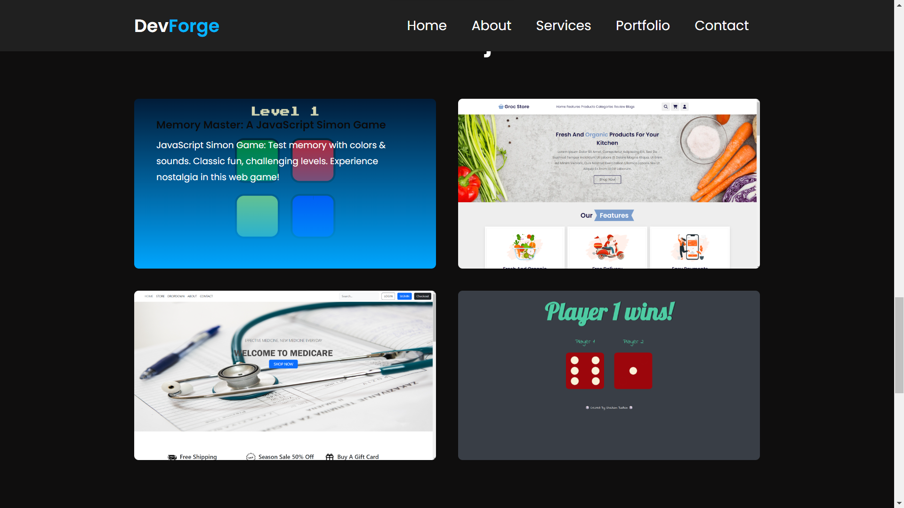

# Testing

Return back to the [README.md](README.md) file.

1. **Feature-by-Feature Testing:**
   - **Navigation:** Ensuring smooth transitions between pages, links directing to the correct destinations.
   - **Responsive Design:** Checking for compatibility across various devices and screen sizes.
   - **Portfolio Display:** Verifying that projects are properly showcased with accurate descriptions, images, and links.
   - **Contact Form:** Testing the form submission process, ensuring the user receives a confirmation, and you receive the message.

2. **User Story Testing:**
   - **Usability Testing:** Have users (or simulated users) interact with the site and provide feedback. Document any issues encountered and the resolutions implemented.
   - **Accessibility Testing:** Confirm compliance with accessibility standards (e.g., screen reader compatibility, proper alt text for images, keyboard navigation).

3. **Compatibility Testing:**
   - **Browser Compatibility:** Testing on different browsers (Chrome, Firefox, Safari, Edge, etc.) to ensure consistent performance.
   - **Device Compatibility:** Ensuring functionality across various devices (desktops, laptops, tablets, and mobile phones).

4. **Documentation and Logs:**
   - Maintain records of testing procedures, results, and any bugs encountered along with their resolutions. This helps demonstrate a systematic approach to testing and problem-solving.

## Code Validation

### HTML

I have used the recommended [HTML W3C Validator](https://validator.w3.org) to validate all of my HTML files.

| Page | W3C URL | Screenshot | Notes |
| --- | --- | --- | --- |
| Home | [W3C](https://validator.w3.org/nu/?doc=https%3A%2F%2FShugu19.github.io%2FProject-1%2Findex.html) |  | |

### CSS

I have used the recommended [CSS Jigsaw Validator](https://jigsaw.w3.org/css-validator) to validate all of my CSS files.

| File | Jigsaw URL | Screenshot | Notes |
| --- | --- | --- | --- |
| style.css | [Jigsaw](https://jigsaw.w3.org/css-validator/validator?uri=https%3A%2F%2FShugu19.github.io%2FProject-1) |  | Pass: No Errors |

### js

I have used the recommended [jshint Validator](https://jshint.com/) to validate all of my CSS files.

| File | source | Screenshot | Notes |
| --- | --- | --- | --- |
| script.js | Jshint |  | Pass: No Errors |

## Browser Compatibility

I've tested my deployed project on multiple browsers to check for compatibility issues.

| Browser | Home | About | Services | Portfolio | Contact | 
| --- | --- | --- | --- | --- | --- |
| Chrome | |  |  |  |   | Works as expected |
| Firefox |  |  |  |  |  | Works as expected |
| Microsoft-Edge |  |  |  |  |  | Works as expected |

## Responsiveness

I've tested my deployed project on multiple devices to check for responsiveness issues.

| Device | Home | About | Services | Portfolio | Contact |
| --- | --- | --- | --- | --- | --- |
| Mobile (DevTools) |  |  |  |  | | Works as expected |
| Tablet (DevTools) |  |  |  |  |  | Works as expected |
| Desktop |  |  |  |  |  | Works as expected |

## Lighthouse Audit

I've tested my deployed project using the Lighthouse Audit tool to check for any major issues.

| Page | screenshot | 
| --- | --- |
| Home |  | 

## User Story Testing

- As a new site user, I would like to **explore the 'Home' section**, so that I can quickly understand the purpose of the website and get an overview of the creator's identity and expertise.

- As a new site user, I would like to **navigate to the 'About' section**, so that I can delve deeper into the background, education, and professional journey of the website creator, establishing a personal connection.

- As a new site user, I would like to **check out the 'Services' section**, so that I can understand the specific skills and services offered by the creator, helping me determine if they align with my needs or interests.

- As a new site user, I would like to **explore the 'Portfolio' section**, so that I can visually experience the creator's previous work, gaining insights into their capabilities, style, and the range of projects they have undertaken.

- As a new site user, I would like to **visit the 'Contact' section**, so that I can easily find ways to connect with the creator, whether for job opportunities, project collaborations, or general inquiries.

- As a returning site user, I would like to **access the 'Portfolio' section directly from the homepage**, so that I can quickly view any new projects or updates since my last visit.

- As a returning site user, I would like to **check for any updates in the 'Services' section**, so that I can stay informed about additional skills or services the creator may have added since my last visit.

- As a returning site user, I would like to **explore the 'About' section periodically**, so that I can stay updated on any changes or developments in the creator's professional journey and skills.

- As a returning site user, I would like to **easily find and use the contact information**, so that I can reach out to the creator for potential collaborations or follow-up discussions.

- As a returning site user, I would like to **benefit from a responsive and intuitive navigation system**, so that I can efficiently explore the website and find the information I need with ease, enhancing my overall user experience.