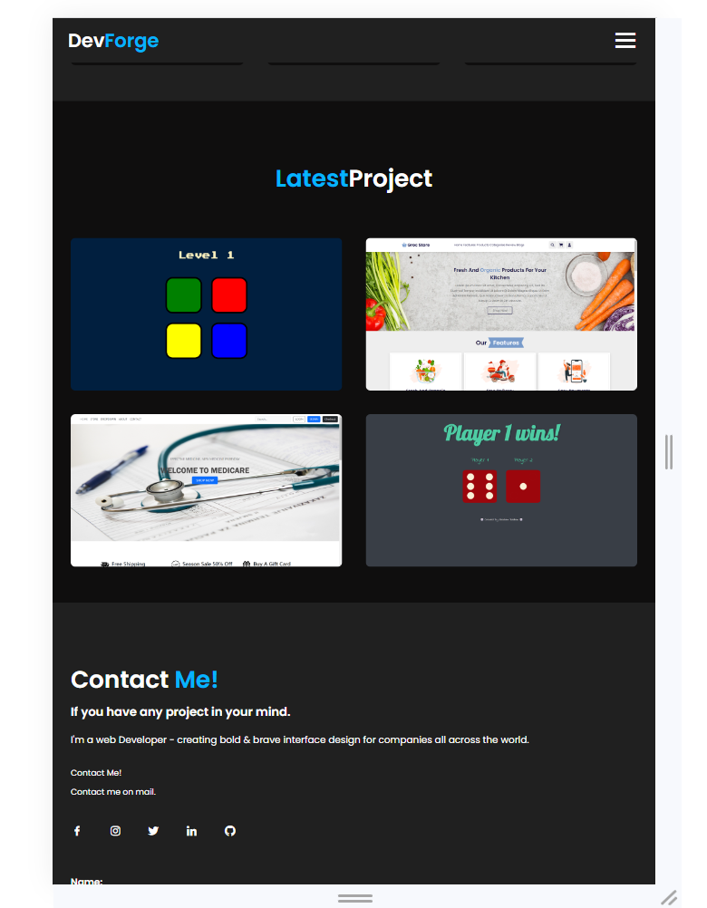
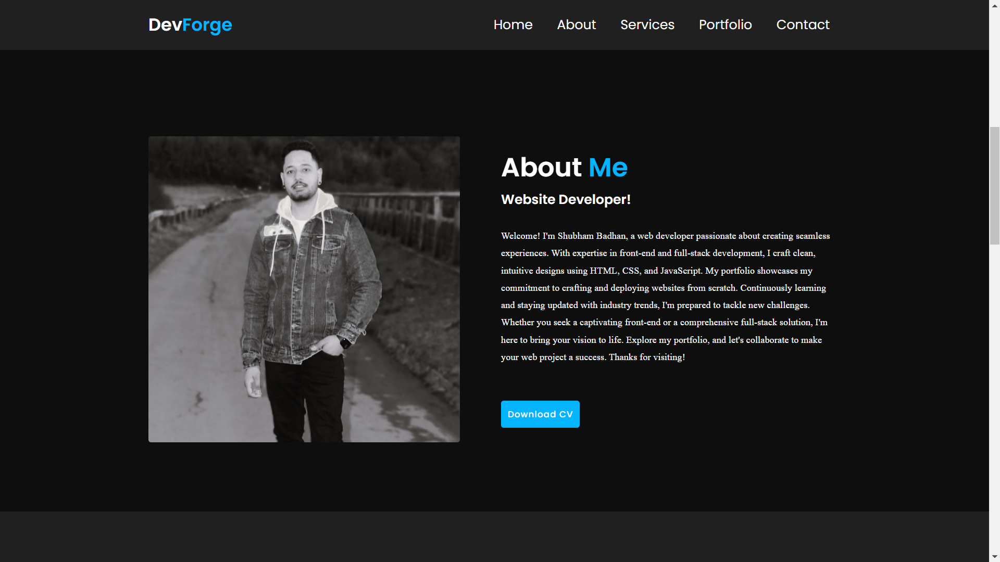

# Testing

Return back to the [README.md](README.md) file.

1. **Feature-by-Feature Testing:**
   Go through each feature of your portfolio site and detail the testing process for each. Explain the functionality and demonstrate how it aligns with the intended purpose. This could include:
   - **Navigation:** Ensuring smooth transitions between pages, links directing to the correct destinations.
   - **Responsive Design:** Checking for compatibility across various devices and screen sizes.
   - **Portfolio Display:** Verifying that projects are properly showcased with accurate descriptions, images, and links.
   - **Contact Form:** Testing the form submission process, ensuring the user receives a confirmation, and you receive the message.

2. **User Experience Testing:**
   - **Usability Testing:** Have users (or simulated users) interact with the site and provide feedback. Document any issues encountered and the resolutions implemented.
   - **Accessibility Testing:** Confirm compliance with accessibility standards (e.g., screen reader compatibility, proper alt text for images, keyboard navigation).

3. **Compatibility Testing:**
   - **Browser Compatibility:** Testing on different browsers (Chrome, Firefox, Safari, Edge, etc.) to ensure consistent performance.
   - **Device Compatibility:** Ensuring functionality across various devices (desktops, laptops, tablets, and mobile phones).

4. **Performance Testing:**
   - **Speed and Load Testing:** Tools like PageSpeed Insights or GTmetrix to check page load times and optimize where necessary.
   - **Scalability Testing:** Assess how the site handles increased traffic or usage.

5. **Regression Testing:**
   - After implementing fixes or updates, ensure that previous features and functionalities still work as intended. This prevents new changes from breaking existing features.

6. **Documentation and Logs:**
   - Maintain records of testing procedures, results, and any bugs encountered along with their resolutions. This helps demonstrate a systematic approach to testing and problem-solving.

7. **User Feedback Incorporation:**
   - If applicable, mention how user feedback has been taken into account and implemented to enhance the user experience.

## Code Validation

### HTML

I have used the recommended [HTML W3C Validator](https://validator.w3.org) to validate all of my HTML files.

| Page | W3C URL | Screenshot | Notes |
| --- | --- | --- | --- |
| Home | [W3C](https://validator.w3.org/nu/?doc=https%3A%2F%2FShugu19.github.io%2FProject-1%2Findex.html) |  | |

### CSS

I have used the recommended [CSS Jigsaw Validator](https://jigsaw.w3.org/css-validator) to validate all of my CSS files.

| File | Jigsaw URL | Screenshot | Notes |
| --- | --- | --- | --- |
| style.css | [Jigsaw](https://jigsaw.w3.org/css-validator/validator?uri=https%3A%2F%2FShugu19.github.io%2FProject-1) |  | Pass: No Errors |

### js

I have used the recommended [jshint Validator](https://jshint.com/) to validate all of my CSS files.

| File | Jigsaw URL | Screenshot | Notes |
| --- | --- | --- | --- |
| script.js | [Jshint](https://jigsaw.w3.org/css-validator/validator?uri=https%3A%2F%2FShugu19.github.io%2FProject-1) |  | Pass: No Errors |

## Browser Compatibility

I've tested my deployed project on multiple browsers to check for compatibility issues.

| Browser | Home | About | Services | Portfolio | Contact | 
| --- | --- | --- | --- | --- | --- |
| [Chrome] | |  |  |  |   | Works as expected |
| [Firefox] |  |  |  |  |  | Works as expected |
| [Microsoft-Edge] |  |  |  |  |  | Works as expected |
## Responsiveness

I've tested my deployed project on multiple devices to check for responsiveness issues.

| Device | Home | About | Services | Portfolio | Contact |
| --- | --- | --- | --- | --- | --- |
| Mobile (DevTools) |  |  |  |  | | Works as expected |
| Tablet (DevTools) |  |  |  |  |  | Works as expected |
| Desktop |  |  |  |  |  | Works as expected |

## Lighthouse Audit

I've tested my deployed project using the Lighthouse Audit tool to check for any major issues.

| Page |
| --- | --- | --- | --- |
| Home |  | 
