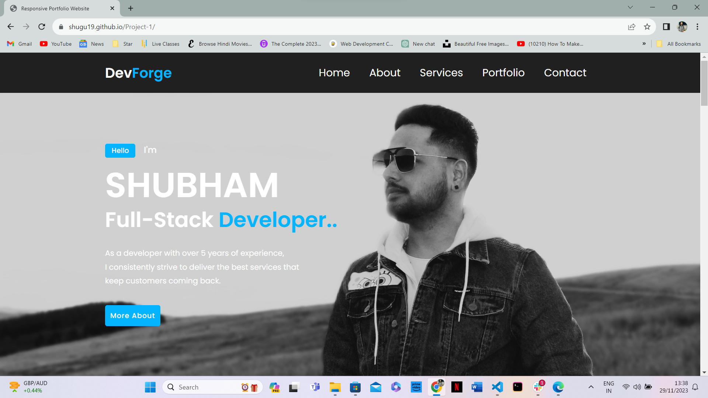

# Testing

Return back to the [README.md](README.md) file.

1. **Feature-by-Feature Testing:**
   Go through each feature of your portfolio site and detail the testing process for each. Explain the functionality and demonstrate how it aligns with the intended purpose. This could include:
   - **Navigation:** Ensuring smooth transitions between pages, links directing to the correct destinations.
   - **Responsive Design:** Checking for compatibility across various devices and screen sizes.
   - **Portfolio Display:** Verifying that projects are properly showcased with accurate descriptions, images, and links.
   - **Contact Form:** Testing the form submission process, ensuring the user receives a confirmation, and you receive the message.

2. **User Experience Testing:**
   - **Usability Testing:** Have users (or simulated users) interact with the site and provide feedback. Document any issues encountered and the resolutions implemented.
   - **Accessibility Testing:** Confirm compliance with accessibility standards (e.g., screen reader compatibility, proper alt text for images, keyboard navigation).

3. **Compatibility Testing:**
   - **Browser Compatibility:** Testing on different browsers (Chrome, Firefox, Safari, Edge, etc.) to ensure consistent performance.
   - **Device Compatibility:** Ensuring functionality across various devices (desktops, laptops, tablets, and mobile phones).

4. **Performance Testing:**
   - **Speed and Load Testing:** Tools like PageSpeed Insights or GTmetrix to check page load times and optimize where necessary.
   - **Scalability Testing:** Assess how the site handles increased traffic or usage.

5. **Regression Testing:**
   - After implementing fixes or updates, ensure that previous features and functionalities still work as intended. This prevents new changes from breaking existing features.

6. **Documentation and Logs:**
   - Maintain records of testing procedures, results, and any bugs encountered along with their resolutions. This helps demonstrate a systematic approach to testing and problem-solving.

7. **User Feedback Incorporation:**
   - If applicable, mention how user feedback has been taken into account and implemented to enhance the user experience.

## Code Validation

### HTML

I have used the recommended [HTML W3C Validator](https://validator.w3.org) to validate all of my HTML files.

| Page | W3C URL | Screenshot | Notes |
| --- | --- | --- | --- |
| Home | [W3C](https://validator.w3.org/nu/?doc=https%3A%2F%2FShugu19.github.io%2FProject-1%2Findex.html) |  | |

### CSS

I have used the recommended [CSS Jigsaw Validator](https://jigsaw.w3.org/css-validator) to validate all of my CSS files.

| File | Jigsaw URL | Screenshot | Notes |
| --- | --- | --- | --- |
| style.css | [Jigsaw](https://jigsaw.w3.org/css-validator/validator?uri=https%3A%2F%2FShugu19.github.io%2FProject-1) |  | Pass: No Errors |
| checkout.css | n/a |  | Pass: No Errors |
| x | x | x | 

## Browser Compatibility

I've tested my deployed project on multiple browsers to check for compatibility issues.

| Browser | Home | About | Contact | etc | Notes |
| --- | --- | --- | --- | --- | --- |
|  |  |  |  |  | Works as expected |
|  |  |  |  |  | Works as expected |
|  |  |  |  |  | Works as expected |
|  |  |  |  |  | Minor CSS differences |
|  |  |  |  |  | Works as expected |
|  |  |  |  |  | Minor differences |
| repeat for any other tested browsers | x | x | x | x | x |

## Responsiveness

⚠️⚠️⚠️⚠️⚠️ START OF NOTES (to be deleted) ⚠️⚠️⚠️⚠️⚠️

Use this space to discuss testing the live/deployed site on various device sizes.

The minimum requirement is for the following 3 tests:
- Mobile
- Tablet
- Desktop

**IMPORTANT**: You must provide screenshots of the tested responsiveness, to "prove" that you've actually tested them.

Using the "amiresponsive" mockup image (or similar) does not suffice the requirements.
Consider using some of the built-in device sizes in the Developer Tools.

If you have tested the project on your actual mobile phone or tablet, consider also including screenshots of these as well.
It showcases a higher level of manual tests, and can be seen as a positive inclusion!

Sample responsiveness testing documentation:

🛑🛑🛑🛑🛑 END OF NOTES (to be deleted) 🛑🛑🛑🛑🛑

I've tested my deployed project on multiple devices to check for responsiveness issues.

| Device | Home | About | Contact | etc | Notes |
| --- | --- | --- | --- | --- | --- |
| Mobile (DevTools) |  |  |  |  | Works as expected |
| Tablet (DevTools) |  |  |  |  | Works as expected |
| Desktop |  |  |  |  | Works as expected |
| XL Monitor |  |  |  |  | Scaling starts to have minor issues |
| 4K Monitor |  |  |  |  | Noticeable scaling issues |
| Google Pixel 7 Pro |  |  |  |  | Works as expected |
| iPhone 14 |  |  |  |  | Works as expected |
| repeat for any other tested browsers | x | x | x | x | x |

## Lighthouse Audit

⚠️⚠️⚠️⚠️⚠️ START OF NOTES (to be deleted) ⚠️⚠️⚠️⚠️⚠️

Use this space to discuss testing the live/deployed site's Lighthouse Audit reports.
Avoid testing the local version (especially if developing in Gitpod), as this can have knock-on effects of performance.

If you don't have Lighthouse in your Developer Tools,
it can be added as an [extension](https://chrome.google.com/webstore/detail/lighthouse/blipmdconlkpinefehnmjammfjpmpbjk).

Don't just test the home page (unless it's a single-page application).
Make sure to test the Lighthouse Audit results for all of your pages.

**IMPORTANT**: You must provide screenshots of the results, to "prove" that you've actually tested them.

Sample Lighthouse testing documentation:

🛑🛑🛑🛑🛑 END OF NOTES (to be deleted) 🛑🛑🛑🛑🛑

I've tested my deployed project using the Lighthouse Audit tool to check for any major issues.

| Page | Mobile | Desktop | Notes |
| --- | --- | --- | --- |
| Home |  |  | Some minor warnings |
| About |  |  | Some minor warnings |
| Gallery |  |  | Slow response time due to large images |
| x | x | x | repeat for any other tested pages/sizes |

## User Story Testing

⚠️⚠️⚠️⚠️⚠️ START OF NOTES (to be deleted) ⚠️⚠️⚠️⚠️⚠️

Testing user stories is actually quite simple, once you've already got the stories defined on your README.

Most of your project's **features** should already align with the **user stories**,
so this should as simple as creating a table with the user story, matching with the re-used screenshot
from the respective feature.

🛑🛑🛑🛑🛑 END OF NOTES (to be deleted) 🛑🛑🛑🛑🛑

| User Story | Screenshot |
| --- | --- |
| As a new site user, I would like to ____________, so that I can ____________. |  |
| As a new site user, I would like to ____________, so that I can ____________. |  |
| As a new site user, I would like to ____________, so that I can ____________. |  |
| As a returning site user, I would like to ____________, so that I can ____________. |  |
| As a returning site user, I would like to ____________, so that I can ____________. |  |
| As a returning site user, I would like to ____________, so that I can ____________. |  |
| As a site administrator, I should be able to ____________, so that I can ____________. |  |
| As a site administrator, I should be able to ____________, so that I can ____________. |  |
| As a site administrator, I should be able to ____________, so that I can ____________. |  |
| repeat for all remaining user stories | x |

## Bugs

⚠️⚠️⚠️⚠️⚠️ START OF NOTES (to be deleted) ⚠️⚠️⚠️⚠️⚠️

This section is primarily used for JavaScript and Python applications,
but feel free to use this section to document any HTML/CSS bugs you might run into.

It's very important to document any bugs you've discovered while developing the project.
Make sure to include any necessary steps you've implemented to fix the bug(s) as well.

**PRO TIP**: screenshots of bugs are extremely helpful, and go a long way!

🛑🛑🛑🛑🛑 END OF NOTES (to be deleted) 🛑🛑🛑🛑🛑

- JS Uncaught ReferenceError: `foobar` is undefined/not defined

    

    - To fix this, I _____________________.

- JS `'let'` or `'const'` or `'template literal syntax'` or `'arrow function syntax (=>)'` is available in ES6 (use `'esversion: 11'`) or Mozilla JS extensions (use moz).

    

    - To fix this, I _____________________.

- Python `'ModuleNotFoundError'` when trying to import module from imported package

    

    - To fix this, I _____________________.

- Django `TemplateDoesNotExist` at /appname/path appname/template_name.html

    

    - To fix this, I _____________________.

- Python `E501 line too long` (93 > 79 characters)

    

    - To fix this, I _____________________.

## Unfixed Bugs

⚠️⚠️⚠️⚠️⚠️ START OF NOTES (to be deleted) ⚠️⚠️⚠️⚠️⚠️

You will need to mention unfixed bugs and why they were not fixed.
This section should include shortcomings of the frameworks or technologies used.
Although time can be a big variable to consider, paucity of time and difficulty understanding
implementation is not a valid reason to leave bugs unfixed.

If you've identified any unfixed bugs, no matter how small, be sure to list them here.
It's better to be honest and list them, because if it's not documented and an assessor finds the issue,
they need to know whether or not you're aware of them as well, and why you've not corrected/fixed them.

Some examples:

🛑🛑🛑🛑🛑 END OF NOTES (to be deleted) 🛑🛑🛑🛑🛑

- On devices smaller than 375px, the page starts to have `overflow-x` scrolling.

    

    - Attempted fix: I tried to add additional media queries to handle this, but things started becoming too small to read.

- For PP3, when using a helper `clear()` function, any text above the height of the terminal does not clear, and remains when you scroll up.

    

    - Attempted fix: I tried to adjust the terminal size, but it only resizes the actual terminal, not the allowable area for text.

- When validating HTML with a semantic `section` element, the validator warns about lacking a header `h2-h6`. This is acceptable.

    

    - Attempted fix: this is a known warning and acceptable, and my section doesn't require a header since it's dynamically added via JS.

⚠️⚠️⚠️⚠️⚠️ START OF NOTES (to be deleted) ⚠️⚠️⚠️⚠️⚠️

If you legitimately cannot find any unfixed bugs or warnings, then use the following sentence:

🛑🛑🛑🛑🛑 END OF NOTES (to be deleted) 🛑🛑🛑🛑🛑

There are no remaining bugs that I am aware of.
